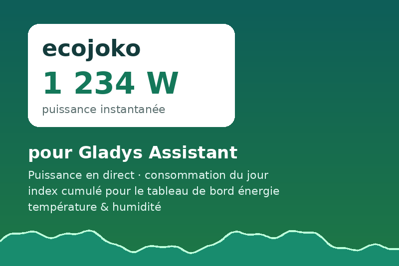

# Gladys ecojoko

[Gladys Assistant](https://gladysassistant.com) external integration for the
[ecojoko](https://www.ecojoko.com/) energy assistant — the Gladys counterpart
of the community Home Assistant integration
[little_monkey](https://github.com/jmcruvellier/little_monkey).

Two devices: the **meter** (live power in W, a synthesized cumulative index in
kWh Gladys derives its energy dashboard from, today's consumption, optionally
per tariff period and the solar surplus) and, when the account reports it, the
**ambient** sensor of the display (indoor/outdoor temperature and humidity).



## Install

In Gladys: **Integrations → search "ecojoko" → Install**, then enter the
credentials of your ecojoko account. The user documentation lives in
[docs/en.md](docs/en.md) / [docs/fr.md](docs/fr.md) and is shown by Gladys
during installation.

## How it reads

ecojoko publishes no API. `src/ecojoko.js` talks to the private HTTP interface
of `service.ecojoko.com` that the ecojoko web app uses (reverse-engineered by
the community; endpoints and error codes documented at the top of the file):
a login that sets an `LKS` session cookie, the gateway list, then
`realtime_conso` (live power), `powerstat/w/<date>` (one entry per day of the
week: total kWh, per-period split, solar surplus) and `tempstat` /
`humstat` for the ambient values. Read-only, nothing is ever written.

Two points worth knowing before hacking on it:

- **The cumulative index is synthesized** (`src/index-store.js`). Gladys only
  derives 30-minute consumption and cost from an `energy-sensor`/`index`
  feature, and ecojoko exposes daily totals only. The store folds each
  completed day into a persisted base (`/data`, the sandbox's single writable
  path), backfills days missed while stopped from the weekly statistics, and
  clamps the index so it never decreases.
- **The schedule lives in the container** (`src/scheduler.js`), not in Gladys
  polling: two cadences on one device (live power every few seconds, daily
  statistics every few minutes). Bad credentials stop the timers on purpose;
  any other failure keeps retrying and flags the integration as disconnected
  after three misses. Gladys polling is a trap worth knowing: the core only
  polls a device published with **both** `should_poll: true` and a
  `poll_frequency` from its fixed list (1, 2, 10, 15, 30, 60 s), the Discovery
  screen posts the payload as-is and nothing infers one flag from the other.
  The devices here say `should_poll: false` explicitly, and `onPoll` still
  answers with an immediate reading if someone turns polling on by hand.

## Development

```bash
npm install
npm test          # node --test (scripted fake of the ecojoko service)
npm run lint      # eslint
npm run format    # prettier
```

The layout follows the official
[integration-template-js](https://github.com/GladysAssistant/integration-template-js):
`index.js` wires the SDK, `src/devices/` declares the Gladys payloads,
`src/actions.js` the Configuration-screen button,
`gladys-assistant-integration.json` is the manifest the store indexer reads.

## Release

GitHub **Actions → Release → Run workflow** (patch/minor/major). The workflow
bumps `package.json` + manifest in lockstep, tags, and publishes the
multi-arch image (amd64 + arm64) to
[ghcr.io/guim31/gladys-ecojoko](https://ghcr.io/guim31/gladys-ecojoko).

## Legal

Independent community project, not affiliated with or endorsed by ecojoko.
The ecojoko name and monkey logo belong to ecojoko and appear on the cover
only to identify the product this integration connects to.
Code under the [Apache-2.0](LICENSE) license.
